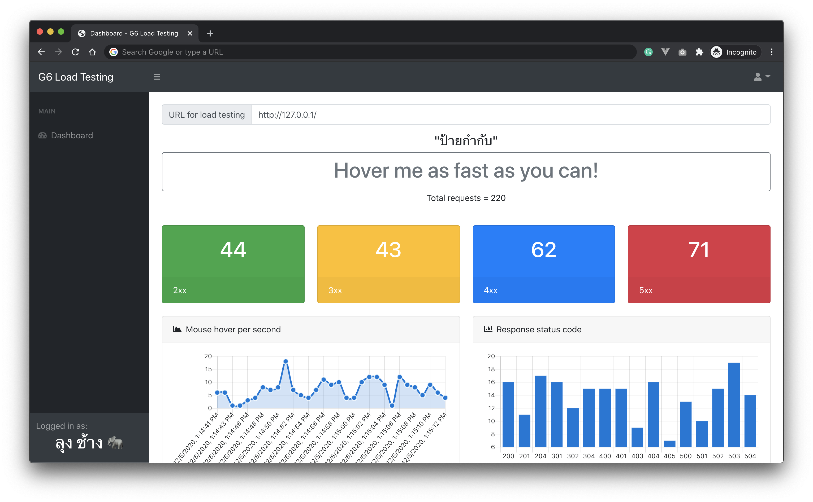

# G6 Load Testing Tool

G6 Load Testing tool is a stupid HTTP Load Generator using mouseover events to send HTTP requests to the target URL.

Inspired by [goragod.com](https://www.goragod.com/)

## Warning
Respect the law please use at your own risk.

## Screen shot

## Known issue

Target URL must allow CORS

## License

WTFPL
http://www.wtfpl.net/